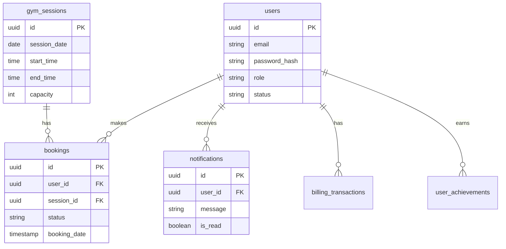
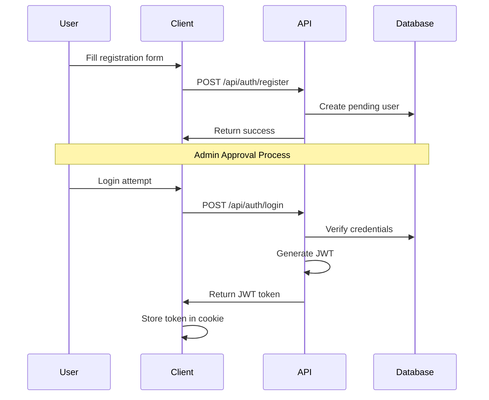

# JCU Gym Management System - Technical Documentation

## 1. Project Overview

The JCU Gym Management System is a full-stack web application built for managing a university gym facility. It provides features for session booking, user management, attendance tracking, and administrative oversight. The system is designed to handle multiple user roles (students and administrators) with different access levels and capabilities.

### Core Features
- User authentication and authorization
- Session booking and management
- Attendance tracking
- Administrative dashboard with analytics
- Real-time booking availability
- Automated waitlist management
- User notifications
- Billing and payment tracking

## 2. Technical Stack

### Frontend
- **Next.js 15.2.4 (App Router)**
  - Server-side rendering
  - API routes integration
  - Advanced routing with layout system
  - Built on React 19

- **React 19**
  - Server and client components
  - Hooks for state management
  - Component composition

- **TypeScript 5**
  - Static typing
  - Interface definitions
  - Type safety across the application

- **UI Framework**
  - Tailwind CSS 3.4.17 for styling
  - shadcn/ui components (based on Radix UI)
  - Lucide React for icons
  - Custom UI components in `/components/ui`

- **Form Handling**
  - React Hook Form with Zod validation
  - Custom form components and hooks
  - Client-side validation patterns

### Backend
- **Next.js API Routes**
  - RESTful API structure in `/app/api`
  - Request validation
  - Error handling middleware

- **Database**
  - PostgreSQL (via Neon.tech)
  - Direct SQL queries using `node-postgres (pg)`
  - Connection pooling
  - Prepared statements for security

- **Authentication**
  - JWT-based authentication
  - Secure password hashing (bcryptjs)
  - Session management
  - Role-based access control

## 3. Architecture & Implementation

### Database Schema
The database uses a normalized schema with the following core tables:

#### Core Tables Structure

```sql
Table: users
+---------------------------+------------------+----------------------------------------+
| Column                    | Type            | Description                            |
+---------------------------+------------------+----------------------------------------+
| id                       | UUID            | Primary key                            |
| email                    | TEXT            | Unique user email                      |
| password_hash            | TEXT            | Bcrypt hashed password                 |
| first_name              | TEXT            | User's first name                      |
| last_name               | TEXT            | User's last name                       |
| student_id              | TEXT            | Unique student identifier              |
| role                    | TEXT            | 'student' or 'admin'                   |
| membership_type         | TEXT            | Subscription type                      |
| status                  | TEXT            | Account status                         |
| created_at              | TIMESTAMP       | Account creation date                  |
+---------------------------+------------------+----------------------------------------+

Table: gym_sessions
+---------------------------+------------------+----------------------------------------+
| Column                    | Type            | Description                            |
+---------------------------+------------------+----------------------------------------+
| id                       | UUID            | Primary key                            |
| date                     | DATE            | Session date                           |
| start_time              | TIME            | Session start time                     |
| end_time                | TIME            | Session end time                       |
| capacity                | INTEGER         | Maximum participants                   |
| current_bookings        | INTEGER         | Current booking count                  |
| type                    | TEXT            | Session type                           |
| instructor              | TEXT            | Instructor name                        |
+---------------------------+------------------+----------------------------------------+

Table: bookings
+---------------------------+------------------+----------------------------------------+
| Column                    | Type            | Description                            |
+---------------------------+------------------+----------------------------------------+
| id                       | UUID            | Primary key                            |
| user_id                  | UUID            | Foreign key to users                   |
| session_id              | UUID            | Foreign key to gym_sessions            |
| status                  | TEXT            | Booking status                         |
| booking_date            | TIMESTAMP       | When booking was made                  |
| check_in_time           | TIMESTAMP       | When user checked in                   |
| check_out_time          | TIMESTAMP       | When user checked out                  |
+---------------------------+------------------+----------------------------------------+
```

#### Database Relationships


#### Key Database Features
- **Indexes**: Optimized for frequent queries
- **Foreign Keys**: Maintaining referential integrity
- **Constraints**: Ensuring data validity
- **Timestamps**: Automatic tracking of records

### API Structure
```
/api/
├── admin/
│   ├── approve-user/
│   ├── billing/
│   ├── bookings/
│   ├── sessions/
│   └── stats/
├── auth/
│   ├── login/
│   ├── logout/
│   └── register/
├── bookings/
├── notifications/
└── sessions/
```

### Frontend Architecture
```
/app/
├── admin/
│   ├── dashboard/
│   └── login/
├── auth/
│   ├── login/
│   └── register/
└── dashboard/
    ├── book/
    └── history/
```

## 4. Core Functionality Implementation

### Authentication Flow

#### Registration and Authentication Process


#### JWT Token Structure
```json
{
  "header": {
    "alg": "HS256",
    "typ": "JWT"
  },
  "payload": {
    "userId": "uuid",
    "email": "user@example.com",
    "role": "student|admin",
    "iat": 1635000000,
    "exp": 1635086400
  }
}
```

#### Security Implementation Details
1. **Registration**
   - Email validation with domain restriction (@my.jcu.edu.au)
   - Password strength requirements
   - Duplicate email/student ID check
   - Automated email verification

2. **Authentication**
   - Rate limiting on login attempts
   - Session tracking
   - Concurrent login handling
   - Automatic token refresh

3. **Authorization**
   - Role-based access control
   - Resource-level permissions
   - API route protection
   - Frontend route guards

### Booking System
```typescript
interface Booking {
  id: string
  userId: string
  sessionId: string
  status: "confirmed" | "cancelled" | "no-show" | "completed"
  bookingDate: string
  checkInTime?: string
  checkOutTime?: string
  isRecurring: boolean
}
```

### Database Operations
The system uses a custom database adapter pattern:
```typescript
class CloudDatabase {
  async createBooking(bookingData: any): Promise<any>
  async getUserBookings(userId: string): Promise<Booking[]>
  async updateSessionBookingCount(sessionId: string, increment: number): Promise<void>
}
```

## 5. Key Libraries & Tools

- **Date Handling**: date-fns for date manipulation
- **Calendar**: react-day-picker for date selection
- **Forms**: @hookform/resolvers for form validation
- **UI Components**: 
  - @radix-ui/* for accessible components
  - class-variance-authority for component variants
- **Database**: pg and pg-pool for PostgreSQL connection
- **Security**: bcryptjs and jsonwebtoken


## 6. Custom Utilities & Hooks

### Custom Hooks
- \`use-mobile.tsx\`: Responsive design detection
- \`use-toast.ts\`: Toast notification system

### Utility Functions
Located in `/lib/utils.ts`:
- Database adapters
- Type conversions
- Date formatting
- Authentication helpers

## 7. Performance & Security

### Security Measures

- **Password Hashing with bcryptjs**
  - All user passwords are hashed using bcryptjs with a salt factor of 10
  - Ensures passwords are never stored in plain text
  - Makes rainbow table attacks computationally unfeasible
  - Provides secure password comparison without exposing the original password

- **Prepared SQL Statements**
  - All database queries use parameterized statements
  - Prevents SQL injection attacks
  - Separates SQL logic from data values
  - Improves query plan caching and performance

- **JWT Token Validation**
  - Stateless authentication using JSON Web Tokens
  - Tokens include user role and expiration time
  - Automatic token validation on protected routes
  - Secure token storage in HTTP-only cookies

- **Role-based Access Control**
  - Distinct user roles (student, admin) with different permissions
  - Route-level access control using middleware
  - API endpoint protection based on user roles
  - Frontend route guards for protected pages

- **Input Validation with Zod**
  - Strong type checking and validation at runtime
  - Schema-based validation for all form inputs
  - Custom validation rules for business logic
  - Consistent error handling and messages

### Performance Optimizations

- **Connection Pooling for Database**
  - Maintains a pool of reusable database connections
  - Reduces connection overhead and latency
  - Automatically handles connection lifecycle
  - Configurable pool size based on load (default: 10 connections)

- **Indexed Database Queries**
  - Strategic indexes on frequently queried columns
  - Optimized query patterns for common operations
  - Regular query performance monitoring
  - Indexes on:
    - User email and student ID
    - Session dates and times
    - Booking status and dates
    - Notification timestamps

- **Server-side Rendering**
  - Critical pages rendered on the server
  - Improved initial page load performance
  - Better SEO compatibility
  - Reduced client-side JavaScript bundle

- **Optimized PostgreSQL Schema**
  - Normalized database design to minimize redundancy
  - Appropriate data types for each column
  - Efficient constraints and foreign keys
  - Performance-oriented table partitioning for historical data

## 8. Summary & Design Decisions

The technology stack was chosen to provide:

1. **Developer Experience**
   - **TypeScript for Type Safety**
     - Catch errors early in development
     - Improved code completion and IntelliSense
     - Better refactoring capabilities
     - Self-documenting code through types

   - **Next.js for Simplified Deployment**
     - Zero-config deployment options
     - Automatic code splitting
     - Built-in optimization features
     - Integrated development environment

   - **Modern Tooling and Frameworks**
     - Latest React features and patterns
     - Industry-standard development tools
     - Rich ecosystem of compatible libraries
     - Active community support

2. **Performance**
   - **Server-side Rendering**
     - Faster initial page loads
     - Improved SEO capabilities
     - Better performance on slow devices
     - Reduced client-side processing

   - **Optimized Database Queries**
     - Efficient query patterns
     - Strategic use of indexes
     - Query result caching
     - Minimized database round trips

   - **Connection Pooling**
     - Reduced connection overhead
     - Better resource utilization
     - Improved application scalability
     - Consistent performance under load

3. **Maintainability**
   - **Clear Project Structure**
     - Intuitive folder organization
     - Separation of concerns
     - Consistent naming conventions
     - Well-defined module boundaries

   - **Type Definitions**
     - Self-documenting interfaces
     - Compile-time error checking
     - Easy refactoring
     - Better IDE support

   - **Component Modularity**
     - Reusable UI components
     - Isolated business logic
     - Clear component responsibilities
     - Easy testing and maintenance

4. **Scalability**
   - **PostgreSQL for Reliable Data Storage**
     - ACID compliance
     - Advanced querying capabilities
     - Robust indexing options
     - High concurrent performance

   - **Serverless-ready Architecture**
     - Auto-scaling capabilities
     - Pay-per-use cost model
     - No server maintenance
     - Global deployment options

   - **Modular API Design**
     - Independent service endpoints
     - Versioned API routes
     - Clear separation of concerns
     - Easy to extend and modify

     - Manual capacity adjustment
     - Basic conflict resolution
     - Limited recurring session support

This documentation reflects the current implementation while providing insight into the system's architecture and design decisions.
