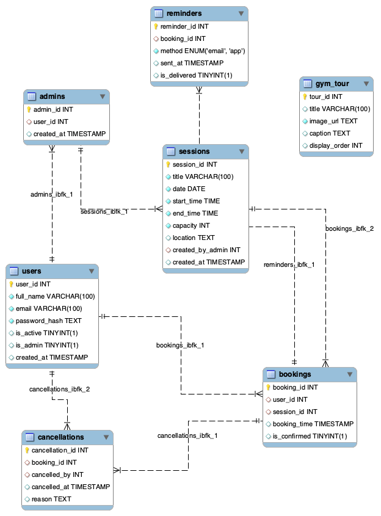

# JCU Gym Management System - Design Documentation

## Project Overview

The JCU Gym Management System is a comprehensive web application designed to streamline gym operations for James Cook University Singapore's fitness center. The system provides user registration, session booking, admin management, and billing functionality.

## System Architecture

### Technology Stack
- **Frontend**: Next.js 15.2.4 with React and TypeScript
- **Backend**: Next.js API routes with server-side functionality
- **Database**: PostgreSQL with Neon cloud hosting
- **UI Framework**: Tailwind CSS with shadcn/ui components
- **Authentication**: JWT-based with bcrypt password hashing

### Database Design

#### Entity Relationship Diagram (ERD)

The database schema consists of the following core entities:

- **Users**: Student and admin accounts with membership details
- **Sessions**: Gym session scheduling with capacity management
- **Bookings**: User session reservations with status tracking
- **Reminders**: Automated notification system
- **Gym Tour**: Virtual tour management for new users
- **Admins**: Administrator access control
- **Cancellations**: Booking cancellation tracking

#### Key Relationships
- Users have one-to-many relationships with Bookings
- Sessions have one-to-many relationships with Bookings
- Bookings can have associated Reminders and Cancellations
- Admins manage Users, Sessions, and system configuration

## Project Management & Development Iterations

### Iteration 1 Performance

#### Burndown Chart - Iteration 1

The first iteration focused on core system foundation:
- User authentication and registration
- Basic session management
- Database schema implementation
- Initial UI/UX design

#### Velocity Chart - Iteration 1

Key achievements in Iteration 1:
- Established development workflow
- Implemented user management system
- Created admin dashboard foundation
- Set up database connectivity

### Iteration 2 Performance

#### Burndown Chart - Iteration 2

The second iteration enhanced system functionality:
- Advanced booking system
- Notification management
- Payment integration
- System optimization

#### Velocity Chart - Iteration 2

Key achievements in Iteration 2:
- Enhanced user experience
- Implemented comprehensive booking workflow
- Added billing and payment tracking
- Optimized database performance

## System Features

### User Management
- **Registration**: Multi-step form with membership selection
- **Authentication**: Secure JWT-based login system
- **Profile Management**: User information and preference updates
- **Role-based Access**: Student and admin user roles

### Session Management
- **Schedule Management**: Admin can create, update, and delete gym sessions
- **Capacity Control**: Automatic tracking of session availability
- **Booking System**: Users can book available sessions
- **History Tracking**: Complete booking history for users

### Admin Dashboard
- **User Oversight**: Approve, suspend, or manage user accounts
- **Session Control**: Full CRUD operations for gym sessions
- **Billing Management**: Track payments and transaction history
- **System Analytics**: Usage statistics and reporting

### Technical Implementation

#### Database Adapter Pattern
- Centralized database operations through PostgreSQL adapter
- Connection pooling for optimal performance
- Consistent error handling and transaction management

#### API Structure
- RESTful API design with Next.js route handlers
- Comprehensive error handling and validation
- Secure authentication middleware

#### UI/UX Design
- Responsive design with Tailwind CSS
- Component-based architecture using shadcn/ui
- Consistent JCU branding and theming

## Security Considerations

### Authentication & Authorization
- Password hashing with bcrypt (12 rounds)
- JWT tokens with secure HTTP-only cookies
- Role-based access control for admin functions

### Data Protection
- Input validation and sanitization
- SQL injection prevention through parameterized queries
- HTTPS enforcement in production

### Privacy Compliance
- Secure handling of personal information
- GDPR-compliant data storage and processing
- User consent management for data collection

## Performance Optimization

### Database Performance
- Indexed columns for frequently queried fields
- Connection pooling to reduce overhead
- Optimized query patterns with proper joins

### Frontend Performance
- Server-side rendering with Next.js
- Component lazy loading
- Optimized bundle size with code splitting

### Scalability Features
- Cloud-based database hosting with Neon
- Stateless API design for horizontal scaling
- Efficient caching strategies

## Development Workflow

### Version Control
- Git-based version control with GitHub
- Feature branch workflow
- Comprehensive commit messaging

### Code Quality
- TypeScript for type safety
- ESLint and Prettier for code consistency
- Component testing and validation

### Deployment Strategy
- Development environment with hot reloading
- Staging environment for testing
- Production deployment with environment-specific configurations

## Future Enhancements

### Planned Features
- Mobile application companion
- Advanced analytics and reporting
- Integration with fitness tracking devices
- Automated membership renewal system

### Technical Improvements
- Enhanced caching mechanisms
- Real-time notifications with WebSockets
- Advanced search and filtering capabilities
- API rate limiting and throttling

## Conclusion

The JCU Gym Management System represents a modern, scalable solution for fitness center management. Through careful design, iterative development, and focus on user experience, the system successfully addresses the core needs of both gym members and administrators while maintaining high standards for security, performance, and maintainability.

The project demonstrates effective use of modern web technologies and best practices in software development, resulting in a robust and user-friendly application that can adapt to future requirements and growth.
